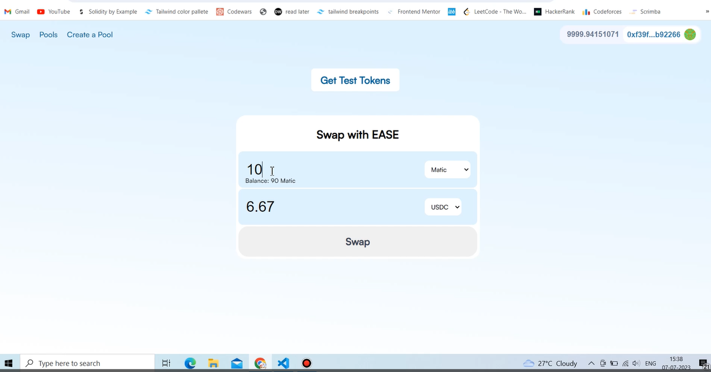

# An ERC20 DEX (Decentralized Exchange) like Uniswap

## Hey, If you are here from Linkedin, then definitely give this repo a STAR ⭐

[See Live Demo of the dApp](https://vimeo.com/843177286?share=copy)

### - Swap an ERC20 Token
Users/Traders can trade tokens directly on the blockchain without the need for a centralized intermediary

### - Earn Yeilds on your Tokens
The users can provide liquidity to the liquidity pools to earn rewards and incentives in the form of liquidity tokens which is aka Yeild Farming

### - Create Customized Liquidity Pools
You can pick a FEE, and a pair of Tokens to create a pool of your own

### - Uses Constant Product AMM
It is an Automated Market Maker for transparent and relevent pricing of Tokens